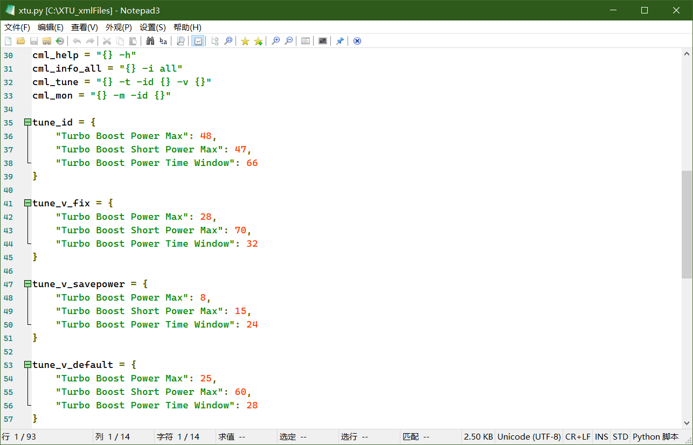

# XTU_Script
Intel(R) Extreme Tuning Utility Service Control Script - XTU 自动超频脚本

Use Script to control XTU's functions whitout GUI (PerfTune.exe)

通过脚本控制 XTU 超频，而非官方 GUI，可以减少一个后台常驻应用。

> 虽然官方 GUI 可以在应用了 Profile 之后就退出，也不影响超频设置，但总归不方便。lazy...

Usage:

- Make sure XTU (Intel(R) Extreme Tuning Utility) Service running automatically

> The Service is usually installed with XTU automatically and starts in a while with the system login

- Download and Place `xtu.py` to `C:\XTU_xmlFiles` folder

- Excute the following command:

```bash
# Energe Saving Mode Profile
# 省电模式
python "C:\XTU_xmlFiles\xtu.py" save


# Gaming Mode Profile
# 性能模式
python "C:\XTU_xmlFiles\xtu.py" game

# Show Mode Profile
# 查看当前超频信息
python "C:\XTU_xmlFiles\xtu.py" info

```

你可以根据自己的需求修改脚本使用。
You can modify the script to meet your needs.


比如文件 `quickCommand.json` 是我的`utools`的插件`快捷命令`的配置,可以让我快速切换模式


